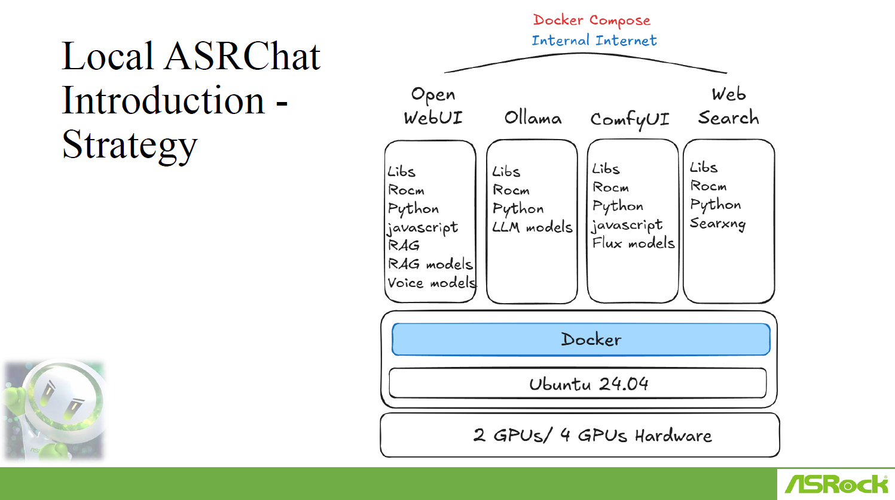
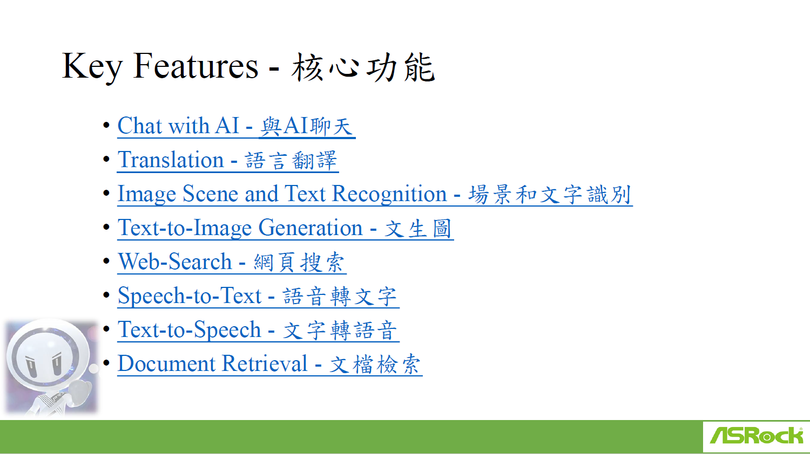
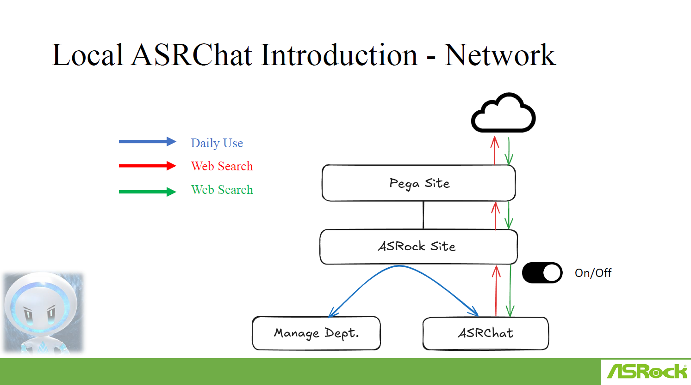
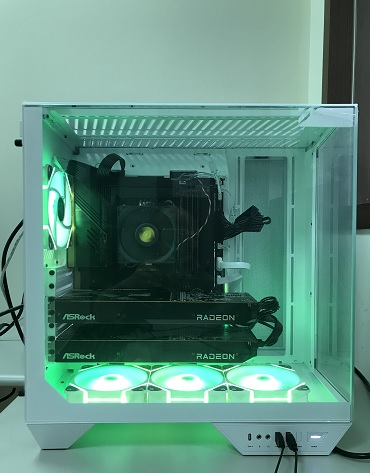
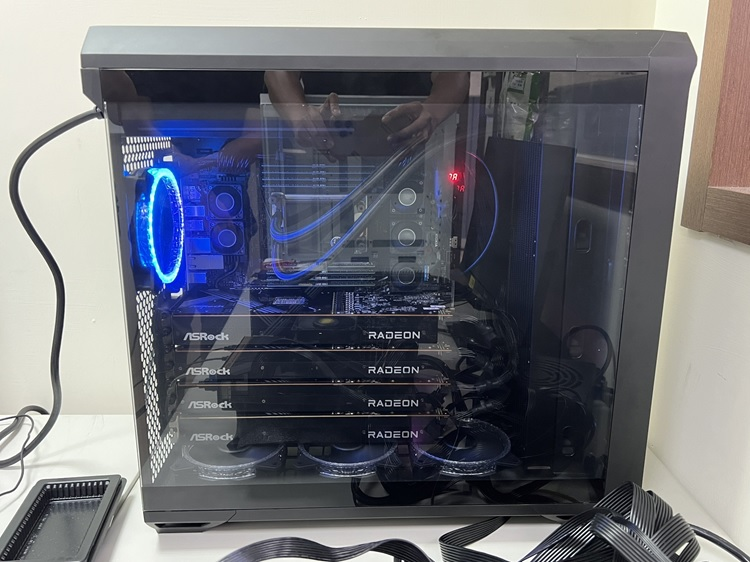

# ASRChat

## Introduction
Local ASRChat is an AI-powered assistant designed to operate within a secure, internal environment. It leverages advanced AI capabilities, including large language models (LLMs), retrieval-augmented generation (RAG), and multimodal processing, to deliver comprehensive AI-assisted services. The system is optimized to run locally on high-performance hardware without requiring an external internet connection.

---

## Strategy
### Architecture Overview
The Local ASRChat system is built on a containerized infrastructure using Docker, running on Ubuntu 24.04. It supports multiple AI functionalities through specialized modules:

- **Open WebUI**: Provides a user-friendly web interface for AI interaction, incorporating RAG and voice models.
- **Ollama**: Hosts and manages LLM models for natural language understanding.
- **ComfyUI**: Enables generative AI workflows, including text-to-image and flux model processing.
- **Web Search**: Uses SearXNG for private, customizable web search capabilities.

### System Components
- **Docker-based Deployment**: Ensures modular and scalable system architecture.
- **Ubuntu 24.04**: Stable and secure OS for AI processing.
- **Hardware**: Optimized for 2-GPU and 4-GPU configurations to maximize AI performance.

---

## Key Features
Local ASRChat offers a suite of AI-driven features designed to enhance productivity and interaction.

- **Chat with AI**: Conversational AI assistant for various tasks.
- **Translation**: Multi-language translation services.
- **Image Scene and Text Recognition **: AI-based image and text analysis.
- **Text-to-Image Generation**: AI-powered image creation from text.
- **Web Search**: Secure and efficient information retrieval.
- **Speech-to-Text**: Converts spoken words into text.
- **Text-to-Speech**: Reads out text content in a natural voice.
- **Document Retrieval**: AI-assisted document searching and indexing.

---

## Network Architecture
### Secure and Configurable AI Network
The Local ASRChat system is designed with a flexible network architecture to accommodate both internal and external data sources. It operates within ASRock’s internal sites, allowing for controlled web searches and daily AI-assisted tasks.

- **Daily Use**: Standard AI functionalities used within the ASRock environment.
- **Web Search**: Controlled internet access for retrieving external information.
- **Web Search**: Internal search queries that remain within the secure network.
- **On/Off Toggle**: Provides administrators with the ability to enable or disable external connections.

---

## Deployment and Hardware Requirements
### Software Stack
- **Operating System**: Ubuntu 24.04
- **Containerization**: Docker with multi-container support
- **Frameworks**: Python, ROCm for GPU acceleration, JavaScript for UI interactions

## Hardware Configuration
- **Minimum Requirement**: 2 GPUs
- **Recommended**: 4 GPUs for enhanced AI model performance

---

# Conclusion
Local ASRChat is a robust, AI-driven assistant tailored for enterprise and research environments. By running AI workloads locally, it ensures data security while offering powerful multimodal processing capabilities. With its modular design and flexible deployment options, Local ASRChat is an essential tool for organizations looking to integrate AI into their workflows.
