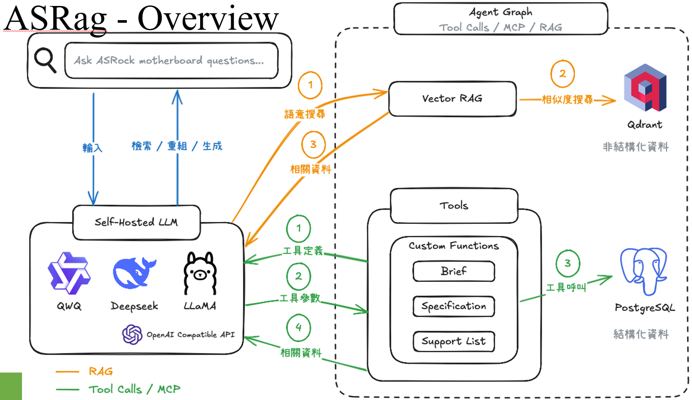
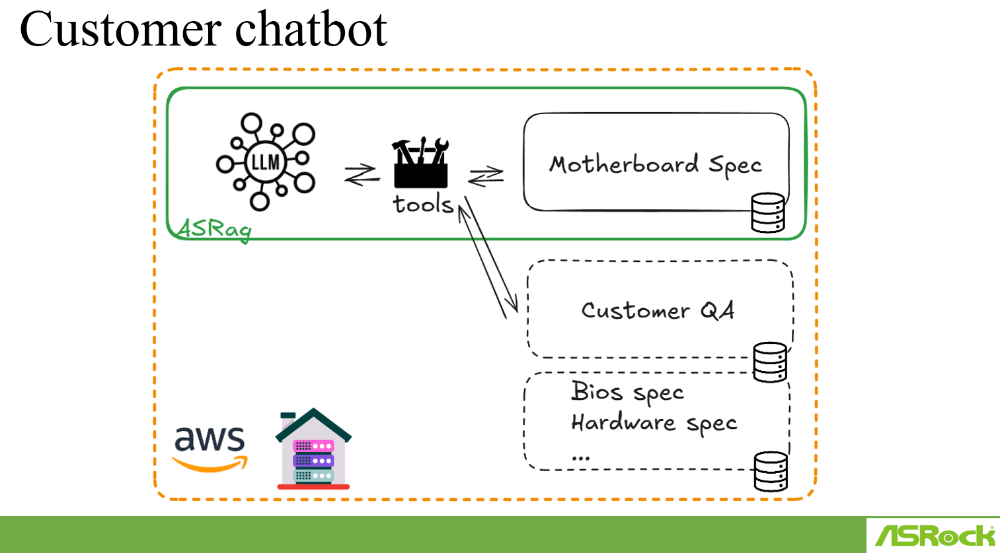
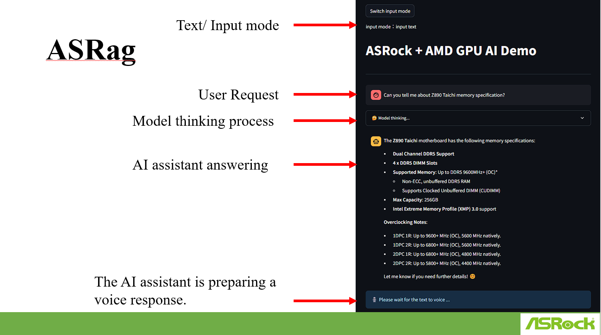

# ASRag Document

ASRag allows the system to provide informative and accurate answers to a wide range of questions by leveraging both unstructured knowledge and structured data.

## Core Components and Worflow

In essence, ASRag uses a combination of:
* Semantic Search (Vector RAG): To quickly find broadly relevant information based on the meaning of the user's question.
* Specialized Tools: To access precise, structured data when needed.
* A Powerful Language Model: To understand the question, synthesize the retrieved information, and generate a natural-language answer.

|The Core Components||
|-|-|
|Self-Hosted LLM (Large Language Model)|This is the brain of the system. It's a powerful AI model (like QWEN, Deepseek, or LLaMA) running on their own infrastructure. It understands natural language and can generate text. It also has an OpenAI-compatible API, meaning other tools can easily communicate with it.|
|Vector RAG (Retrieval-Augmented Generation)|This is a key part of how the system finds relevant information.|
||Qdrant: This is a vector database. Think of it as a highly organized library where information is stored as "vectors" that capture the meaning and relationships between different pieces of text.|
||Process: When a user asks a question (step 1, indicated by the orange arrow), the Vector RAG system takes that question and converts it into a vector. It then searches the Qdrant database for similar vectors (step 2, orange arrow labeled "相似度搜索" meaning "similarity search"). This retrieves relevant documents or chunks of information related to the user's query (step 3, orange arrow labeled "相關資料" meaning "related data").|
|Tools|These are specialized functions that the LLM can use to get more specific information or perform actions. In this case, the "Tools" box contains "Custom Functions" like "Brief," "Specification," and "Support List."|
|PostgreSQL|This is a traditional relational database used to store structured data ("結構化資料").|
|Agent Graph (Tool Calls / MCP / RAG)|This seems to be the overall orchestrator of the process, deciding when to use the Vector RAG and when to call specific tools.|

|The Workflow||
|-|-|
|User Asks a Question (Input)|The user types in their question about an ASRock motherboard.|
|Vector RAG Retrieval|The question is sent to the Vector RAG system. The system searches the Qdrant vector database for semantically similar information. Relevant information is retrieved.|
Information Flow to LLM|The retrieved information from the Vector RAG ("相關資料") is fed back to the Self-Hosted LLM.|
|Tool Invocation (Optional)|Based on the user's question and the information from the Vector RAG, the LLM might decide it needs more specific data. It then chooses an appropriate "Tool" (e.g., "Specification" if the user asks for technical details). It sends a request to the "Tools" component (step 1, green arrow labeled "工具定義" meaning "tool definition"). This request includes parameters for the chosen tool (step 2, green arrow labeled "工具參數" meaning "tool parameters").|
|Tool Execution and Data Retrieval|The selected custom function (e.g., "Specification") interacts with the PostgreSQL database (step 3, green arrow labeled "工具呼叫" meaning "tool call"). The tool retrieves specific structured data from PostgreSQL (step 4, green arrow labeled "相關資料").|
|LLM Processes and Generates Answer (整合 / 重組 / 生成 - Integration / Reorganization / Generation)|The Self-Hosted LLM now has: The original user question. Relevant information from the Vector RAG. Potentially, specific data retrieved by the "Tools" from PostgreSQL. The LLM integrates all this information, reorganizes it, and generates a comprehensive answer to the user's question.|
|Output|The generated answer is presented to the user.|

## Customize

The customer chatbot relies on the ASRag system (likely with an LLM) to understand and answer questions.
It uses "tools" as an interface to access various structured data sources containing product specifications and customer support information.

The chatbot can be designed to handle questions about different areas.

The entire infrastructure can be hosted on AWS.

## UX

