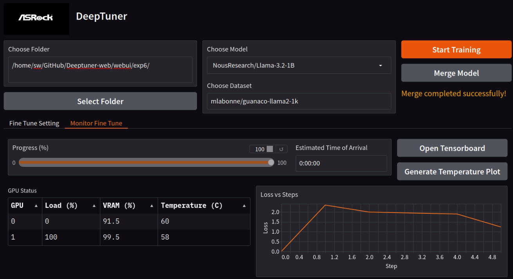
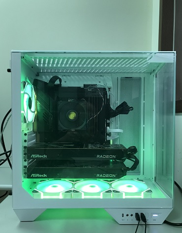

# ASRock DeepTuner | Docs

- [ASRock DeepTuner | Docs](#asrock-deeptuner--docs)
  - [Revision History](#revision-history)
  - [What is ASRock DeepTuner?](#what-is-asrock-deeptuner)
  - [Requirements](#requirements)
    - [Hardware Requirements](#hardware-requirements)
    - [Software Requirements](#software-requirements)
  - [Performance](#performance)
  - [Guide](#guide)
    - [Manage experiments](#manage-experiments)
    - [Fine-tuning Setting](#fine-tuning-setting)
      - [Select GPUs](#select-gpus)
      - [Model Parallel](#model-parallel)
      - [Training Settings](#training-settings)
      - [Hardware and Memory Management Settings](#hardware-and-memory-management-settings)
      - [Hugging Face Library](#hugging-face-library)
    - [System Monitor](#system-monitor)
    - [Merge Model](#merge-model)
    - [Inference](#inference)
  - [Key Terms](#key-terms)
    - [Pre-Trained Model](#pre-trained-model)
    - [NLP (Natural Language Processing)](#nlp-natural-language-processing)
    - [LLM Backbone](#llm-backbone)
    - [Quantization](#quantization)
    - [Checkpoint](#checkpoint)
    - [Naive Model Parallel](#naive-model-parallel)
    - [Fully Sharded Data Parallel](#fully-sharded-data-parallel)
    - [Batch Size](#batch-size)
    - [Epochs](#epochs)
    - [Optimizer](#optimizer)
    - [Learning Rate](#learning-rate)
    - [Learning Rate Scheduler Type](#learning-rate-scheduler-type)
    - [Mixed-Precision Training](#mixed-precision-training)
    - [Weight Decay](#weight-decay)
    - [Loss Function](#loss-function)
    - [Gradient Checkpointing](#gradient-checkpointing)
    - [Gradient Accumulation Steps](#gradient-accumulation-steps)
    - [Saving Steps](#saving-steps)
    - [Paramater-Effcient Fine-Tuning](#paramater-effcient-fine-tuning)
    - [LoRA](#lora)
    - [QLoRA](#qlora)
    - [LoRA Alpha](#lora-alpha)
    - [LoRA Rank](#lora-rank)
    - [LoRA Dropout](#lora-dropout)
    - [Safetensors](#safetensors)
  - [FAQs](#faqs)

---

## Revision History

|Date|Revision|Description|Affected Content|
|-|-|-|-|
|2024/12/10|1.0|Original Release|n/a|

---

## What is ASRock DeepTuner?

ASRock DeepTuner is a no-code graphical user interface (GUI) that enables users to fine-tune advanced large language models (LLMs) using AMD ROCm™ technology, simplifying customization of AI models without requiring programming expertise.

Fine-tuning a [Pre-Trained Model](#pre-trained-model) generally demands coding skills and a deep understanding of model architecture and hyperparameters. ASRock DeepTuner removes these barriers, enabling [NLP (Natural Language Processing)](#nlp-natural-language-processing) practitioners to fine-tune large language models (LLMs) without any coding, while still offering extensive options for customization.

This tool is designed for anyone interested in developing their own language models, making fine-tuning accessible to users of all technical backgrounds. It is especially beneficial for NLP practitioners and data scientists seeking to efficiently create and optimize large language models. Additionally, it supports a Command Line Interface (CLI) for users who prefer or require command-line operations.

---

## Requirements 
### Hardware Requirements
* ASRock AMD Radeon™ RX 7000 Series Graphics Cards and above
* 128GB memory and above
* 2TB disk and above

### Software Requirements
* Ubuntu 24.04 LTS

## Performance
* Configuration: The type and number of computing devices used to train the model.
* Backbone: The underlying architecture of the language model. For more information, see [LLM backbone](#llm-backbone).
* Quantization: A technique used to reduce the size and memory requirements of the model. ASRock DeepTuner sets 4-bit NormalFloat for QLoRA to optimize GPU memory. For more information, see [Quantization](#quantization).
* Fine-Tuning time of 100K-sample: The amount of time it took to train the model, presented in hours and minutes.

|Configuration|Backbone|Quantization|Fine-Tuning time of 100K-sample(hh:mm)|
|:-|:-|:-|:-|
|2x7900XTX 24GB|llama3.2-1b|nf4|03:03|
|2x7900XTX 24GB|llama3.2-3b|nf4|06:48|
|2x7900XTX 24GB|llama2-7b|nf4|11:24|
|2x7900XTX 24GB|llama3.1-8b|nf4|15:12|
|2x7900XTX 24GB|llama2-13b|nf4|22:46|
|2x7900XTX 24GB|opt-30b|nf4|54:10|
|4x7900XTX 24GB|llama3.2-1b|nf4|00:54|
|4x7900XTX 24GB|llama3.2-3b|nf4|02:24|
|4x7900XTX 24GB|llama2-7b|nf4|03:45|
|4x7900XTX 24GB|llama3.1-8b|nf4|04:30|
|4x7900XTX 24GB|llama2-13b|nf4|06:54|
|4x7900XTX 24GB|opt-30b|nf4|17:00|
|4x7900XTX 24GB|llama3-70b|nf4|36:48|
|4x7900XTX 24GB|llama3.1-70b|nf4|38:11|
|4x7900XTX 24GB|qwen.5-110b|nf4|55:30|
|4x7900XTX 24GB|twilight-miqu-146b|nf4|72:54|
|4x7900XTX 24GB|theprocessor-155b|nf4|79:30|

---
## Guide

### Manage experiments
Click the `Select Folder` button to locate your experiment data. This includes model, dataset, [Checkpoint](#checkpoint) and log file.
Choose model and dataset in `Choose Model` and `Choose Dataset` list menu.


### Fine-tuning Setting
Proper configuration of experiment settings is essential for efficiently managing fine-tuning processes. The sections below outline the key components required to set up an experiment successfully.
ASRock DeepTuner provides two default settings: `Speed Up` for faster processing and `Higher Precision` for enhanced accuracy. You can apply a configuration by loading a saved setup through the `Upload Config` option.

#### Select GPUs
Choose the GPU(s) by selecting the `GPU#` checkbox.

#### Model Parallel
Specify the model parallelization type by selecting either the `Naive Model Parallel` or `Fully Sharded Data Parallel` checkbox.
Understand [Naive Model Parallel](#naive-model-parallel) and [Fully Sharded Data Parallel](#fully-sharded-data-parallel).

#### Training Settings
[Batch size](#batch-size): The batch size defines how many samples are processed simultaneously in one forward and backward pass. It affects both performance and training time.
Larger batch sizes can improve stability but require more memory. Smaller batch sizes allow training on limited hardware but may increase noise in gradient updates.

[Epochs](#epochs): Set the number of epochs (full passes through the training data). Consider using early stopping to avoid overfitting, halting training once validation performance plateaus or worsens.

[Optimizer](#optimizer) Selection: Select an optimizer that suits your task and model.

[Learning Rate](#learning-rate): Specify the learning rate and consider using learning rate schedulers to adapt the rate during training. Techniques like warm-up or cosine decay can improve convergence.

[Learning Rate Scheduler Type](#learning-rate-scheduler-type): Choosing the right LR scheduler depends on the problem you're solving and the model you're training. Experimenting with different LR schedules can often lead to better convergence and faster training.

[Weight Decay](#weight-decay): Set a hyperparameter to adds the penalty term to the [loss function](#loss-function). L2 Regularization, in most modern frameworks, the two terms are often treated equivalently.

[Mixed-Precision Training](#mixed-precision-training): Mixed-precision training is enabled by default to boost performance. It uses lower-precision formats (e.g., FP16) to reduce memory usage and speed up training without sacrificing model accuracy.

#### Hardware and Memory Management Settings
[Gradient Checkpointing](#gradient-checkpointing): Activate gradient checkpointing if you experience GPU out-of-memory (OOM) issues during training. This technique reduces memory usage by only storing activations at specific layers and recomputing them during the backward pass. It may add some computational overhead but allows training on larger models.

[Gradient Accumulation Steps](#gradient-accumulation-steps): Define the number of iterations during which gradients are accumulated before performing a weight update. This approach simulates a larger effective batch size when hardware memory is limited.

[Saving Steps](#saving-steps): Specify points within the neural network where intermediate activations are saved to memory. Instead of storing all activations, this selectively retains only the necessary ones for backpropagation.

#### Hugging Face Library

[Paramater-Effcient Fine-Tuning(PEFT)](#paramater-effcient-fine-tuning): PEFT is integrated with the Transformers, Diffusers, and Accelerate libraries to provide a faster and easier way to load, train, and use large models for inference.
ASRock DeepTuner offers two fine-tuning options: [LoRA](#lora) and [QLoRA](#qlora).

[LoRA Alpha](#lora-alpha): A scaling factor applied to the updates made by the low-rank matrices introduced by LoRA.

[LoRA Rank](#lora-rank): Definition: The rank of the low-rank approximation matrices.

[LoRA Dropout](#lora-dropout): Dropout applied to the low-rank layers during training.

### System Monitor
Click the `Monitor Fine Tune` button to oversee the fine-tuning process. This includes experiment progress, estimated time, GPU status and logs. Additionally, you can click `Open Tensorboard` to check more information.


### Merge Model

After completing the training, click `Generate Temperature Plot` button to create `GPU Report.png`, allowing you to review the GPU status throughout the entire training process.
Next, click the `Merge Model` button to combine the training weights with the pre-trained model.
Once the message `Merge completed successfully!` appears, the merged model (saved with [safetensors](#safetensors) weights) will be stored in the `merge` directory within your selected folder.





### Inference

To perform inference using [ollama](https://github.com/ollama/ollama/tree/main), you need to create a [Modelfile](https://github.com/ollama/ollama/blob/main/docs/modelfile.md) .

1. An example for the `Modelfile`: Save it as a file (e.g. `Modelfile`)
```bash 
FROM . 

TEMPLATE """[INST] <<SYS>>{{ .System }}<</SYS>> 
{{ .Prompt }} [/INST]""" 

PARAMETER stop "[INST]" 
PARAMETER stop "[/INST]" 
PARAMETER stop "<<SYS>>" 
PARAMETER stop "<</SYS>>"
```
2. Create the model in Ollama
```bash 
ollama create <choose_a_model_name> -f Modelfile
```
3. Run the model
```bash 
ollama run <choose_a_model_name>
```
When >>> appears, you can begin interacting with the model by inputting queries or prompts.


---

## Key Terms

### Pre-Trained Model
A pre-trained model is a machine learning model that has been trained on a large, general-purpose dataset, enabling it to learn fundamental patterns and knowledge. It can then be fine-tuned on a smaller, task-specific dataset to adapt to particular tasks, such as text classification, translation, or question-answering in NLP.

### NLP (Natural Language Processing)
Natural Language Processing (NLP) is a branch of artificial intelligence (AI) and computational linguistics focused on enabling machines to understand, interpret, and generate human language. NLP powers applications such as  chatbots, language translation, and sentiment analysis.

### LLM Backbone
The LLM Backbone refers to the core architecture and pre-trained weights of a large language model, which serve as the foundation for various natural language processing tasks. It provides the underlying structure that is later fine-tuned for specific tasks or applications.

### Quantization
Quantization is the process of reducing the precision of the numerical representations used in a model to make it more computationally efficient. For example, floating-point (FP32) numbers use 32 bits, while quantized numbers, like 8-bit integers (INT8), only use 8 bits. This can reduce memory usage and speed up inference times but may result in a loss of accuracy.

Advantages: Quantization reduces memory footprint, speeds up computations, lowers power consumption, and improves hardware compatibility (especially with accelerators). Additionally, it can act as a form of regularization during training.

Challenges: It may lead to accuracy degradation due to the loss of precision, particularly in deeper models. Fine-tuning the model post-quantization is necessary to mitigate performance loss.

[Making LLMs even more accessible with bitsandbytes, 4-bit quantization and QLoRA](https://huggingface.co/blog/4bit-transformers-bitsandbytes)

### Checkpoint
A checkpoint is a saved state of a model during training, used to resume the process if interrupted or to prevent progress from being lost. It also allows tracking model performance at different stages.

Key Benefits:
  - Progress Tracking: Allows comparison of model performance over time.
  - Interruption Recovery: Safeguards training progress in case of interruptions.
  - Overfitting Detection: Helps detect overfitting early by evaluating models at multiple stages.
  - Best Model Selection: Facilitates choosing the best-performing checkpoint rather than relying solely on the final model.

### Naive Model Parallel
[MP](https://huggingface.co/docs/transformers/v4.13.0/parallelism) spreads groups of model layers across multiple GPUs.

### Fully Sharded Data Parallel
[FSDP](https://pytorch.org/blog/introducing-pytorch-fully-sharded-data-parallel-api/) is a type of data parallelism that shards model parameters, optimizer states and gradients across DP(Distributed Data Parallel) ranks.

Model parameters are divided into shards and distributed across multiple devices, with each device processing its assigned shard. These devices synchronize with each other to ensure cohesive and unified model training, maintaining the integrity of the training process across all devices.

### Batch Size
Batch size refers to the number of training samples processed before updating the model’s parameters. A larger batch size results in fewer updates but requires more memory, while a smaller batch size makes training slower but more memory-efficient.

Trade-offs:
  - Large Batches: Require more VRAM but provide more stable gradient updates.
  - Small Batches: Use less memory but may lead to noisier gradient updates, which can either help avoid local minima or destabilize training.

### Epochs
An epoch is one complete pass through the entire training dataset. The number of epochs defines how many times the model will iterate over the dataset during training.

For example, with a dataset of 1000 samples and a batch size of 100, one epoch will consist of 10 iterations.

### Optimizer
Choosing the right optimizer is critical to achieving efficient training and improving the overall performance of your model. Optimizers adjust the weights of a neural network by calculating the gradients of the loss function with respect to these weights and updating them accordingly.

The right choice of optimizer can lead to:
  - Improved Model Accuracy: Helps the model learn patterns more effectively.
  - Reduced Overfitting: Prevents the model from memorizing the training data, improving generalization.
  - Better Generalization: Enhances the model's ability to perform well on unseen data.

`Adamw_torch `: [Adamw: Decoupled Weight Decay Regularization](https://arxiv.org/abs/1711.05101), it improves upon Adam by decoupling the weight decay from the gradient-based optimization process, which helps in reducing overfitting. Weight decay regularization penalizes large weights in the model, which can lead to better generalization on unseen data.
Advantages: Better generalization compared to Adam([A Method for Stochastic Optimization](https://arxiv.org/abs/1412.6980)), especially when training deep neural networks.

`page_adamw_32bit `: A variant of the AdamW optimizer designed to be more efficient on 32-bit GPUs. It does this by breaking the model parameters into smaller pages and optimizing each page separately. This can reduce the memory usage of the optimizer and improve its performance on 32-bit GPUs.

### Learning Rate
The learning rate is a key hyperparameter that controls how much the model’s weights are adjusted with respect to the loss gradient during training. High learning rates can speed up training but may lead to suboptimal convergence or instability if the steps are too large. Low learning rates improve precision but may slow down the training process and get stuck in local minima.

Common Practices:
  - Learning Rate Schedulers: These dynamically adjust the learning rate during training, often decreasing it as training progresses to improve convergence.
  - Warm-up and Cosine Decay: These methods increase the learning rate gradually at the beginning and decay it toward the end of training, helping the model to converge smoothly.

### Learning Rate Scheduler Type
An LR (Learning Rate) Scheduler is a technique used in machine learning and deep learning to adjust the learning rate during training. The learning rate is a hyperparameter that controls how much the model's weights are updated in response to the loss gradient during training.

Different types of LR schedulers adjust the learning rate in various ways to improve convergence and model performance. Please refer to [Hyperparameters for lr_scheduler_type in Trainer Arguments](https://discuss.huggingface.co/t/hyperparameters-for-lr-scheduler-type-in-trainer-arguments/38469)

### Mixed-Precision Training
Mixed-precision training combines 16-bit (FP16) and 32-bit (FP32) floating-point operations to accelerate training on modern GPUs. This approach allows for faster computations while maintaining the precision necessary for stability.

Steps:
  - Convert weights to FP16, reducing memory and boosting computation speed.
  - Compute gradients using FP16 weights.
  - Convert gradients back to FP32 to preserve numerical stability.
  - Multiply gradients by the learning rate and update the FP32 weights.

### Weight Decay
Weight decay modifies the optimization process by adding a penalty proportional to the magnitude of the model's weights. This prevents the weights from growing too large, which could lead to overfitting (where the model performs well on training data but poorly on unseen data).

Prevents Overfitting: By discouraging large weights, the model generalizes better to unseen data.
Stabilizes Training: Smaller weights lead to smoother model behavior and reduce the risk of exploding gradients.
Implicit Regularization: Encourages simpler models by penalizing complex parameter configurations.

### Loss Function
A Loss Function is a key component in training machine learning models, as it measures the difference between the model's predicted outputs and the true target values.

It provides feedback to the model on how well it is performing, allowing the optimization algorithm to adjust the model’s parameters to minimize this difference over time.

### Gradient Checkpointing
Gradient checkpointing reduces the memory consumption of deep neural networks during training by saving only selected layer activations (checkpoints). Activations of intermediate layers between checkpoints are recomputed during backpropagation to save memory, allowing larger models to fit on GPUs at the cost of additional computation.

Memory vs. Computation Trade-off: By recomputing activations during the backward pass, memory usage is reduced by a factor of 10 or more, but training time may increase by about 20%.

### Gradient Accumulation Steps
A technique used in deep learning to effectively simulate larger batch sizes when training on hardware with limited memory (e.g., GPUs). Instead of updating the model's weights after computing the gradients for every batch, gradients are accumulated over multiple smaller batches before performing a single optimization step.

Example:
Batch size = 16
Gradient accumulation steps = 4
Effective batch size = 16 × 4 = 64

Train on the first mini-batch (16 samples), compute gradients, and store them.
Train on the second mini-batch (16 samples), compute gradients, and add them to the stored gradients.
Repeat for the third and fourth mini-batches.
After processing four mini-batches, update the weights using the accumulated gradients.

Simulates Larger Batch Sizes: Useful when hardware cannot handle large batch sizes due to memory constraints.
Improved Training Stability: Larger effective batch sizes can result in smoother gradient updates and better convergence.

### Saving Steps
Saving Steps refer to the frequency at which a model's state (e.g., weights, optimizer state, training progress) is saved to disk during training.

Resilience to Failures: Training can be resumed from the last saved checkpoint.
Intermediate Evaluation: Saved models at different steps can be used to evaluate and compare performance over time.
Experiment Management: Helps track and analyze training progress for hyperparameter tuning.

### Paramater-Effcient Fine-Tuning
[PEFT](https://huggingface.co/docs/peft/index)

Full fine-tuning, where all layers of a pre-trained model are updated, is not always necessary or ideal in real usage. The decision depends on several factors, including the application, the model size, the available resources, and the task requirements.

When Full Fine-Tuning is Overkill:
  - Small Task-Specific Dataset: Risk of overfitting when updating all layers with limited task-specific data.
  - Resource Constraints: Full fine-tuning is computationally expensive and memory-intensive, especially for large models (e.g., >10B parameters).
  - Minor Domain Shift: If the task or domain is similar to the pre-trained model's training, partial methods (like PEFT) often suffice.
  - Frequent Model Updates:	In dynamic environments, lightweight methods are better for iterative updates.

### LoRA
[LoRA (Low-Rank Adaptation of Large Language Models)](https://arxiv.org/abs/2106.09685) is a parameter-efficient fine-tuning method that introduces trainable low-rank decomposition matrices into neural networks, while freezing the original model parameters. This method is particularly effective for large transformer models and allows fine-tuning with significantly fewer trainable parameters.

What is Low-Rank Approximation?
Low-rank approximation is a technique from linear algebra used to approximate a matrix by another matrix of lower rank. In the context of neural networks, this involves minimizing the difference between the original and approximated matrices while constraining the complexity (rank) of the approximating matrix. Low-rank approximations are commonly used for data compression and simplifying complex models.

How LoRA Works:
  - Instead of fine-tuning all of a model's parameters, LoRA adds small trainable matrices to specific layers (e.g., linear projections in a transformer’s self-attention layers). These matrices are of lower rank, meaning they require fewer parameters and memory to store and update. This approach allows for efficient fine-tuning while retaining the pre-trained model's original knowledge.

Benefits of LoRA:
  - Memory Savings: Since only the low-rank matrices are updated, the number of trainable parameters is greatly reduced, saving memory.
  - Faster Fine-Tuning: The reduction in parameters allows for faster fine-tuning, as fewer gradients need to be computed and updated.
  - Optimizer Efficiency: When using momentum-based optimizers like AdamW, the optimizer state is smaller, further reducing memory overhead.

Use Case for Transformer Models:
  - LoRA is often applied in transformer models for NLP tasks like text generation or translation. In these cases, it’s common to add the low-rank matrices to some of the linear layers in the transformer’s self-attention mechanism. This allows for quick adaptation to new tasks with minimal impact on the model's pre-trained weights.

LoRA is particularly useful when:
  - You need to fine-tune large models on limited hardware (e.g., single GPU).
  - You have limited time or resources but still require high-quality fine-tuning.
  - Your task-specific dataset is small, and full fine-tuning would risk overfitting or be computationally expensive.

A key approach in natural language processing involves large-scale pre-training on general-purpose data, followed by adaptation to specific tasks or domains. However, as models grow in size, such as GPT-3 with 175 billion parameters, fully fine-tuning all model parameters becomes increasingly impractical. Deploying separate fine-tuned instances of such large models is prohibitively expensive due to high computational and memory requirements.

Low-Rank Adaptation (LoRA) addresses this challenge by freezing the pre-trained model's weights and introducing trainable rank decomposition matrices within each layer of the Transformer architecture. This significantly reduces the number of trainable parameters needed for task-specific fine-tuning. For instance, compared to fine-tuning GPT-3 175B with the Adam optimizer, LoRA reduces trainable parameters by a factor of 10,000 and cuts GPU memory usage by threefold, making fine-tuning more efficient and cost-effective.

### QLoRA
[QLoRA: Efficient Finetuning of Quantized LLMs](https://arxiv.org/abs/2305.14314) is a cutting-edge technique designed to fine-tune Quantized Large Language Models (LLMs) with high memory efficiency while maintaining model performance. It builds on the principles of LoRA by incorporating advanced quantization techniques that further reduce memory usage.

QLoRA introduces the following innovations:
  - 4-bit NormalFloat (NF4): A new data type designed to be optimal for storing normally distributed weights. This provides high precision with fewer bits, reducing the memory required for model weights without losing information.
  - Double Quantization: QLoRA goes beyond standard quantization by quantizing the quantization constants themselves, effectively minimizing the overall memory footprint.
  - Paged Optimizers: These optimizers are designed to handle memory spikes during training, ensuring that the system remains stable and efficient even when handling large-scale models.

The choice of whether to use LoRA or QLoRA depends on the constraints of your project:
  - Memory Efficiency: QLoRA is superior when the primary concern is memory usage, making it ideal for large-scale models on memory-constrained hardware (e.g., GPUs with limited VRAM).
  - Training Speed: LoRA typically offers slightly faster training times compared to QLoRA due to the additional overhead introduced by quantization. If fine-tuning speed is more critical, LoRA may be the better choice.
  - Balance of Both: If you require a balance between memory savings and training speed, QLoRA offers an excellent compromise, delivering substantial memory reductions while maintaining competitive performance.

QLoRA is particularly useful for resource-limited environments where fine-tuning very large models (e.g., multi-billion parameter LLMs) on smaller GPUs is necessary.

### LoRA Alpha
LoRA Alpha, it controls the contribution of the low-rank updates to the model's overall weight adjustment and helps stabilize training and ensures that the fine-tuning doesn't overly perturb the pre-trained weights. [4.1 LOW-RANK-PARAMETRIZED UPDATE MATRICES](https://arxiv.org/abs/2106.09685)
  - Larger values of LoRA Alpha increase the influence of the low-rank updates.
  - Optimal values depend on the task; typically chosen through experimentation.

### LoRA Rank
LoRA Rank, it determines the dimensionality of the additional trainable parameters introduced by LoRA. A higher rank means more capacity to model complex changes, but also increases computational cost.
  - Low ranks (e.g., 4, 8) are typically sufficient for many downstream tasks, maintaining efficiency while achieving good performance.
  - Higher ranks can be useful for more complex tasks or when the fine-tuning requires capturing subtle nuances in the data.
  - LoRA achieves parameter efficiency by keeping the rank small while leveraging the pre-trained model’s frozen weights.

### LoRA Dropout
LoRA Dropout, it regularizes the low-rank matrices, preventing overfitting to the fine-tuning dataset and improves generalization, especially on smaller datasets.
  - A typical dropout rate ranges from 0.1 to 0.3, depending on the task and data size.
  - Higher dropout rates can prevent overfitting but may slow convergence or reduce fine-tuning effectiveness.

### Safetensors
Safetensors is a new simple format for storing [tensors](https://pytorch.org/tutorials/beginner/basics/tensorqs_tutorial.html) safely.

## FAQs

### I want to set up a system to run ASRock DeepTuner. Do you have any suggestions?

||Configuration 1|Configuration 2
|-|-|-|
|GPU|[ASRock RX7900XTX CT 24G](https://asrock.com/Graphics-Card/AMD/Radeon%20RX%207900%20XTX%20Creator%2024GB/) *2|ASRock RX7900XTX CT 24G *4|
|Power|1250W|2000W|
|Memory|DDR5 128G (32GB*4)|DDR5 384G (48GB*8)|
|Motherboard|[ASRock X670E Taichi](https://asrock.com/mb/AMD/X670E%20Taichi/index.asp)|[ASRock WRX90](https://asrock.com/mb/AMD/WRX90%20WS%20EVO/index.asp)|
|CPU|7950X|7965WX|
|Cooler|Air Cooler|Water Cooler|
|Case|DY470|Fractal Design Torrent|
|Storage|2TB M.2 SSD|2TB M.2 SSD|




### Training Parameters Guide

This document presents the key training parameters for training a Large-Language Model (LLM), along with their default values and descriptions. These parameters play a crucial role in controlling the training process, affecting factors such as computational memory efficiency, training speed, and model accuracy. The table covers important parameters like training batch size, evaluation batch size, learning rate, learning rate scheduler type, gradient accumulation steps, number of training epochs, and optimizer algorithms. Understanding and tuning these parameters appropriately can significantly impact the model's training time and final performance.

| Parameter | Default | Description |
| --- | --- | --- |
| Training Batch Size | 2 | The number of samples processed in one forward/backward pass during training. Increasing the batch size can speed up training but may require more memory. Decreasing the batch size can help with limited memory but may slow down training. |
| Evaluation Batch Size | 1 | The number of samples processed in one forward pass during evaluation or inference. A larger batch size can speed up evaluation but may require more memory. |
| Gradient Accumulation Steps | 1 | The number of batches to accumulate gradients before performing an optimizer step. Increasing this value can simulate a larger batch size, allowing training with larger effective batch sizes with limited memory. |
| Model Learning Rate | 1e-4 | The step size at each iteration for updating the model weights during training. A higher learning rate can lead to shorter training time but may have lower accuracy, while a lower learning rate can lead to longer training time but higher accuracy. |
| Learning Rate Scheduler Type | cosine | The type of learning rate scheduler used to adjust the learning rate during training. Common options include "cosine" and "linear". The cosine LR schedule follows a cosine pattern, where the learning rate is gradually decreased from the initial value to a minimum value and then increased again towards the end of training. The linear LR schedule linearly decreases the learning rate from an initial value to a final value over the course of the training process at a constant rate with each epoch.|
| Number of Training Epochs | 3 | The number of complete passes through the entire training dataset during training. More epochs generally lead to better performance but may also overfit the model to the training data. |
| Optimizer | AdamW | The optimization algorithm used to update the model weights during training. Common options include "AdamW". AdamW is a variant of the Adam optimization algorithm that combines adaptive learning rates and momentum with L2 regularization (weight decay) to prevent overfitting and improve generalization performance. |