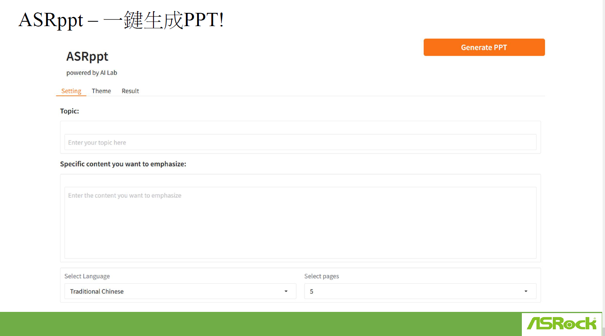
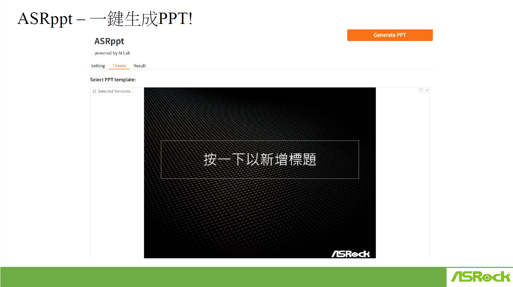
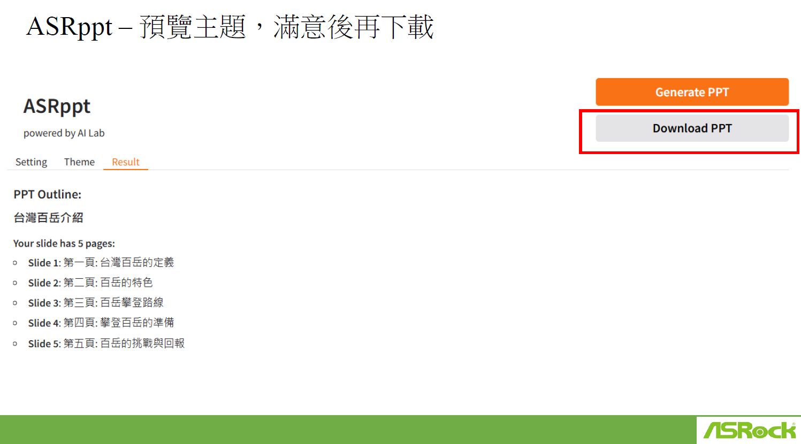

# ASRppt

## 1. Introduction

ASRppt is an AI-powered tool designed to quickly generate PowerPoint presentations. Users input a topic and key content, and ASRppt automatically creates a presentation with a selected theme and number of pages. This tool aims to streamline the presentation creation process, saving users time and effort.

## 2. Key Features

* **AI-Powered Presentation Generation:** ASRppt uses AI to automatically generate presentation slides based on user-provided content.
* **Topic and Content Input:** Users can specify the presentation topic and provide specific content they want to emphasize.
* **Customizable Settings:**
    * **Language Selection:** Users can select the language for their presentation.
    * **Page Selection:** Users can choose the number of pages for their presentation.
    * **Template Selection:** Users can select a PPT template.
* **Theming:** ASRppt offers different themes/templates to customize the look and feel of the presentation.
* **Preview and Download:** Users can preview the generated presentation and download it.
* **User-Friendly Interface:** The interface is designed to be simple and intuitive, with clear input fields and straightforward options.

## 3. How it Works

1.  **Input:** The user enters the presentation topic and specific content.
2.  **Settings:** The user selects the desired language, number of pages, and template.
3.  **Generation:** ASRppt's AI algorithms process the input and generate a PowerPoint presentation.
4.  **Result:** The user can preview the generated presentation.
5.  **Download:** The user can download the ready-to-use PowerPoint presentation.

## 4. Target Audience

* Students
* Educators
* Business professionals
* Anyone who needs to create presentations quickly

## 5. Benefits

* Time-Saving: Quickly generate presentations without manual design.
* Easy to Use: Simple and intuitive interface.
* Customizable: Options for language, page number, and themes/templates.
* AI Powered: Leverages the power of AI.
* Preview: Allows users to review the presentation before downloading.

## 6. Visual Overview

## 7. Future Enhancements

* More language options
* More theme/template selections
* Ability to add images and other media
* More control over layout and design
* Integration with other presentation tools

## 8. Company Information

* Powered by AI Lab
* Branding shown: ASRock
