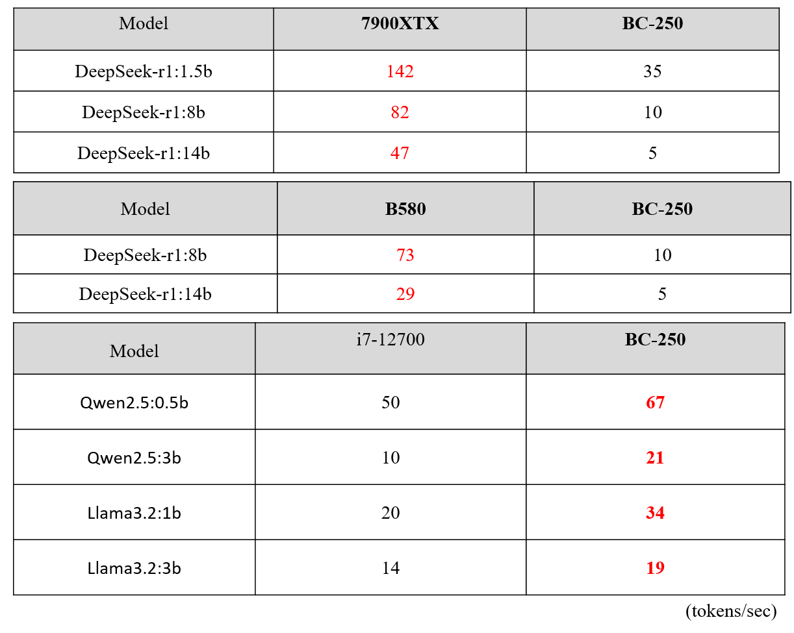

# BC-250 LLM Application and Performance Analysis

* Introduce the application of the BC-250 hardware platform in Large Language Models (LLM), and its performance.

### BC-250 – LLM Models and Results

* DeepSeek-R1 Model: Its main advantage is high-performance at a low cost. Through continuous self-improvement via reinforcement learning, its inference capabilities have reached a level similar to the latest OpenAI models. Offers multiple versions with different parameters, allowing selection based on hardware conditions and application scenarios.

* Qwen2.5: Suitable for Chinese natural language processing tasks, coding, mathematics, etc.
* Llama3.2: A general-purpose model capable of handling most tasks.

### BC-250 – Implementation Technology and Operation Interface 

* Local Operation and Data Storage: All model operations and data storage are performed locally, ensuring data privacy and security and reducing reliance on cloud services.

* Ollama: Provides a continuously updated library of pre-trained models, easy to deploy.
Can run on Linux, macOS, and Windows platforms.

* Gradio: Quickly builds interactive web user interfaces for AI models and Python frameworks, offering a simple and clear user experience. Supports various input and output types, such as text, images, audio, and video.

### BC-250 Performance Comparison

